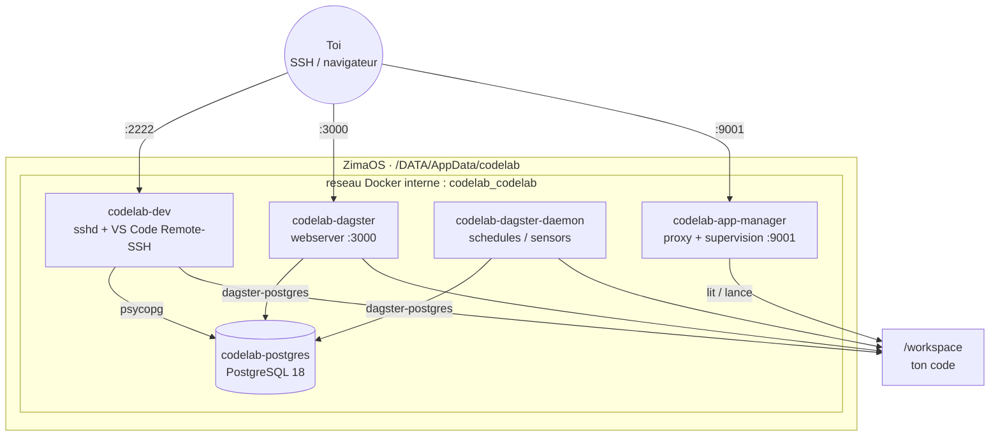

# CodeLab

Environnement de developpement personnel, auto-heberge sur [ZimaOS](https://www.zimaspace.com/zimaos) (compatible CasaOS).
Une seule installation fournit une base de donnees partagee, un acces SSH/VS Code, un orchestrateur de jobs et un
gestionnaire d'applications — le tout persistant, reproductible, et installable en un import de `docker-compose.yml`
depuis l'interface ZimaOS.

## Sommaire

- [Fonctionnalites](#fonctionnalites)
- [Architecture](#architecture)
- [Installation](#installation)
- [Utilisation](#utilisation)
- [Persistance des donnees](#persistance-des-donnees)
- [Publication des images (CI)](#publication-des-images-ci)
- [Notes techniques](#notes-techniques)

## Fonctionnalites

| Service | Role | Port |
|---|---|---|
| **Postgres** | Base de donnees partagee par tous les autres services | interne uniquement |
| **Dev** | Acces SSH + VS Code Remote-SSH, avec un utilisateur dedie | `2222` |
| **Dagster** | Orchestration et planification de jobs (interface web + daemon) | `3000` |
| **App-manager** | Deploiement et supervision des applications que tu developpes | `9001` |

Zero configuration manuelle apres l'installation : mot de passe de base de donnees genere automatiquement, cles SSH
generees et persistees, et connexion a Postgres deja prete dans l'environnement du conteneur `dev` (`PGHOST`,
`PGPORT`, `PGDATABASE`, `PGUSER`, `PGPASSWORD`).

## Architecture



**Principes de conception :**

- **Un seul point de verite** : `docker-compose.yml`, verse dans ce depot. Aucune commande a executer sur le
  serveur — tout part de l'import ZimaOS.
- **Aucun secret en dur** : le mot de passe Postgres est genere aleatoirement au tout premier demarrage du
  conteneur `codelab-postgres` et partage aux autres services via un fichier sur disque, jamais commite ni
  visible dans le compose.
- **Tout persiste par defaut** : chaque service ecrit exclusivement sous `/DATA/AppData/codelab/`, en chemins de
  disque explicites (pas de volume Docker nomme) — un redemarrage, une recreation de conteneur ou une
  reinstallation ne perdent rien.
- **Dagster stocke ses metadonnees dans Postgres**, pas en SQLite local : runs, event logs et schedules restent
  accessibles et coherents avec le reste de l'application.

## Installation

Aucune commande, aucun acces SSH prealable requis.

1. Dans ZimaOS : **App Store → Install via docker-compose**, coller le contenu de `docker-compose.yml`.
2. ZimaOS demande une valeur pour **`SSH_PUBLIC_KEY`** (pas de defaut) : ta cle publique SSH — le contenu de
   `~/.ssh/id_ed25519.pub` (ou equivalent) sur ta machine.
3. Le meme ecran liste les volumes declares avec leurs chemins par defaut. Pour choisir un autre emplacement pour
   le workspace ou les donnees Postgres, modifie-les directement la, avant de valider :
   - `/DATA/AppData/codelab/workspace` — partage entre `codelab-dev`, `codelab-dagster`, `codelab-dagster-daemon`
     et `codelab-app-manager` ; garder le meme chemin sur les quatre.
   - `/DATA/AppData/codelab/postgres` — donnees de la base.
4. Installer. Le mot de passe Postgres, l'etat interne de Dagster/app-manager et les cles hote SSH sont generes
   et geres automatiquement des le premier demarrage.

> Ces deux chemins sont ecrits en dur dans le compose plutot qu'en `${VARIABLE}` : le parseur d'import de ZimaOS
> valide les sources de volume comme des identifiants avant toute substitution, et rejette le caractere `$`. La
> personnalisation passe donc par l'ecran d'installation, pas par un champ de variable.

## Utilisation

### SSH / VS Code

```bash
ssh vscode@<IP-ZimaOS> -p 2222
```

Ou configure une entree dans `~/.ssh/config` et connecte-toi via l'extension **Remote-SSH** de VS Code :

```
Host codelab
    HostName <IP-ZimaOS>
    User vscode
    Port 2222
```

Une fois connecte, ton code vit dans `/workspace`. La connexion a Postgres ne demande aucune configuration :

```bash
python3 -c "
import psycopg
conn = psycopg.connect()
print(conn.execute('SELECT version();').fetchone()[0])
"
```

`psycopg.connect()` sans argument lit automatiquement `PGHOST`, `PGPORT`, `PGDATABASE`, `PGUSER` et `PGPASSWORD`,
deja exportes dans l'environnement de la session (y compris pour les extensions VS Code installees cote distant,
tant qu'elles tournent dans le contexte `Remote-SSH` et non en local).

### App-manager

`http://<IP-ZimaOS>:9001/` — panneau de gestion des applications deployees depuis `/workspace` : demarrage/arret,
logs, port dedie par application, le tout via un unique point d'entree HTTP.

### Dagster

`http://<IP-ZimaOS>:3000/` — interface web. Le fichier `/workspace/definitions.py` est charge comme module Python
`definitions` : c'est le fichier du workspace qui fait foi, pas une copie embarquee dans l'image. S'il est absent
au premier demarrage, un exemple minimal y est copie automatiquement pour eviter un crash au boot.

### Mot de passe Postgres brut

Pour un client SQL externe (DBeaver, TablePlus...), le mot de passe est lisible directement sur le disque du
serveur :

```bash
docker exec codelab-postgres cat /var/lib/codelab/config/postgres_password
```

Le service Postgres n'expose volontairement aucun port sur l'hote — un client externe (hors du reseau Docker
interne) ne peut pas s'y connecter sans modification du compose.

## Persistance des donnees

Tout ce que les conteneurs ecrivent vit sous `/DATA/AppData/codelab/` — aucun volume Docker nomme n'est utilise.
Ca survit a un redemarrage, une recreation de conteneur, et a une reinstallation (desinstaller puis reimporter le
meme `docker-compose.yml`) :

| Chemin hote | Contenu |
|---|---|
| `.../workspace` | Ton code |
| `.../postgres` | Donnees Postgres (toutes les tables) |
| `.../config` | Mot de passe Postgres genere |
| `.../dev-ssh` | `authorized_keys`, regenere a chaque demarrage depuis `SSH_PUBLIC_KEY` |
| `.../dev-host-keys` | Cles hote SSH du conteneur `codelab-dev` — stables tant que ce dossier n'est pas efface, evitent le blocage `MitmPortForwardingDisabled` de VS Code Remote-SSH a chaque reinstallation |
| `.../dagster-home` | Configuration, logs et stockage local Dagster |
| `.../app-manager` | Registre des applications deployees (`apps.json`) et logs |

**Deux points de vigilance, independants du compose lui-meme :**

- Si l'ecran de desinstallation ZimaOS propose une case **« supprimer les donnees de l'application »**, la
  decocher pour conserver ces dossiers.
- `postgres:18` est fige en dur. Un futur passage a `postgres:19` (ou plus) ne demarrera pas directement sur des
  donnees d'une version majeure anterieure — ca demande un `pg_upgrade` manuel prealable. Tant que l'image reste
  en `18`, aucun risque.

## Publication des images (CI)

`.github/workflows/build-images.yml` build et pousse automatiquement les images `codelab-dev`, `codelab-dagster`
et `codelab-app-manager` vers `ghcr.io/lucasrtn/...`, en `amd64` + `arm64`, a chaque push sur `main` qui touche
leur dossier respectif. Declenchable aussi manuellement depuis l'onglet **Actions** (`Run workflow`).

**Etape a faire une seule fois, a la main, sur GitHub** (le workflow ne peut pas le faire lui-meme) : par defaut,
`ghcr.io` cree les packages en **prive**. ZimaOS n'a pas d'identifiants Docker configures, donc un
`docker compose pull` echoue (401) tant que chaque package reste prive.

Apres le premier run du workflow :

1. `github.com/lucasrtn?tab=packages`
2. Ouvrir `codelab-dev`, `codelab-dagster`, `codelab-app-manager` un par un
3. **Package settings → Danger Zone → Change visibility → Public**

A refaire uniquement au tout premier push (une fois public, ca le reste).

## Organisation du depot

```text
codelab/
├── docker-compose.yml
├── .github/workflows/build-images.yml
├── dev/
│   ├── Dockerfile
│   ├── requirements.txt
│   └── runner.py
├── app-manager/
│   ├── Dockerfile
│   └── app.py
└── dagster/
    ├── Dockerfile
    ├── dagster.yaml        # stockage Postgres (run / event / schedule)
    ├── definitions.py      # exemple, copie dans /workspace au 1er demarrage
    └── entrypoint.sh
```

## Notes techniques

- **Cles de service prefixees `codelab-`** (`codelab-postgres`, `codelab-dev`, ...) : ZimaOS cree un sous-dossier
  AppData par service du compose, nomme d'apres la cle YAML plutot que le chemin de volume declare. Le prefixe
  commun garde ces dossiers regroupes dans le File Manager plutot qu'eparpilles a cote d'autres applications.
- **Reseau non-`external`** : `codelab_codelab` est cree automatiquement par ZimaOS au premier
  `docker compose up`, pas de dependance a un reseau preexistant.
- **`dagster-daemon` recoit explicitement `-m definitions`** dans sa commande — sans cet argument, il echoue au
  demarrage (`No arguments given and no [tool.dagster] block in pyproject.toml found`), contrairement au
  webserver qui l'a en dur dans son `Dockerfile`.
- **Sessions SSH et variables d'environnement** : `sshd` n'hérite pas de l'environnement du process qui l'a
  lance. `PGHOST`, `PGPORT`, `PGDATABASE`, `PGUSER` et `PGPASSWORD` sont donc explicitement ecrits dans
  `/etc/profile.d/` et `~/.bashrc` au demarrage du conteneur `dev`, pour rester disponibles dans les sessions
  interactives (dont VS Code Remote-SSH).
